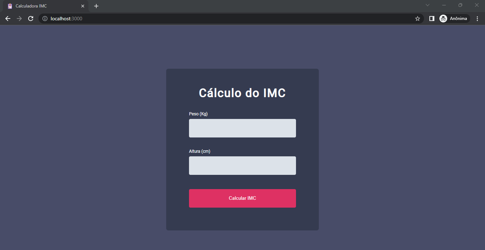

<h1 align="center">Calculadora IMC</h1>

 O Explorer é um programa exclusivo, promovido pela Rocketseat para ensino de tecnologias WEB para iniciantes.

  <a href="#-tecnologias">Tecnologias</a>&nbsp;&nbsp;&nbsp;|&nbsp;&nbsp;&nbsp;
  <a href="#-projeto">Projeto</a>&nbsp;&nbsp;&nbsp;|&nbsp;&nbsp;&nbsp;
  <a href="#memo-licença">Licença</a>

  

 

  

## 🚀 Tecnologias

Esse projeto foi desenvolvido com as seguintes tecnologias:

- HTML e CSS
- JavaScript

## 💻 Projeto

A Calculadora IMC é uma aplicação desenvolvida para realizar o cálculo do índice de massa corporal.
 
- [Visite o projeto](https://wilkasantos.github.io/explorerStage5-calculadoraIMC/)

## :memo: Licença

Esse projeto está sob a licença MIT.

---
